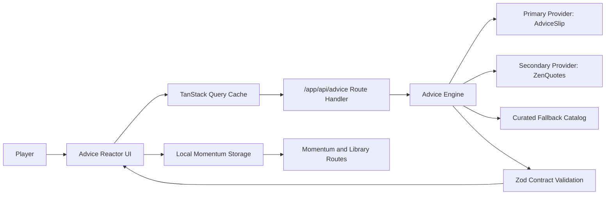

# Advicely Reactor (v4)

Advicely Reactor is a 2026-grade instant advice experience: one-click generation, adaptive tone shaping, and a momentum loop that keeps advice actionable instead of disposable.

## Product Story
- Primary loop: generate a fresh advice card instantly.
- Differentiator: hybrid provider engine with quality scoring, dedupe, and curated fallback when providers fail.
- Retention layer: save, reflect, streak tracking, and share cards.

## Architecture


Detailed architecture contract: [docs/architecture.md](docs/architecture.md)

## Route Map
- `/` Advice Reactor (instant generation and tone control)
- `/momentum` streaks, reflection capture, and session trail
- `/library` saved card catalog with filter and cleanup
- `/share/[id]` local share card rendering
- `/api/advice` normalized advice generation endpoint

## Runtime and Stack
- Next.js App Router + TypeScript strict mode
- React 19
- Chakra UI v3 theming system
- TanStack Query v5
- Zod contracts for API boundaries
- React Hook Form + Zod resolver for reflection capture
- Playwright + Vitest for e2e/unit coverage

## Environment Contract
Copy `.env.example` into `.env.local`.

Server-only keys:
- `ADVICE_PROVIDER_PRIMARY_URL`
- `ADVICE_PROVIDER_SECONDARY_URL`
- `ADVICE_REQUEST_TIMEOUT_MS`

No sensitive values should be exposed via `NEXT_PUBLIC_*`.

## Local Development
```bash
pnpm install
pnpm dev
```

## Quality Gates
```bash
pnpm run check
pnpm run test:e2e
pnpm run docs:check
pnpm run audit:high
```

## Deployment Model
- Platform: Vercel
- Production branch: `master`
- Preview deploys: feature branches and pull requests
- Required checks: CI + CodeQL + audit/docs gates

## Security Posture
- Strict response headers with CSP in `next.config.ts`
- Server-side provider integration only
- Typed env parsing in `lib/env.ts`
- High severity vulnerability gate in CI

## Troubleshooting
- Provider outages: engine falls back to curated catalog; UI remains interactive.
- Duplicate feeling advice: recent hash dedupe prevents immediate repeats.
- Chakra plus Next App Router hydration: this repo uses `next dev --webpack` and `next build --webpack` per Chakra guidance for stable Emotion hydration.
- Docs CI failures: run `pnpm run docs:check` and fix markdown or Mermaid syntax.
