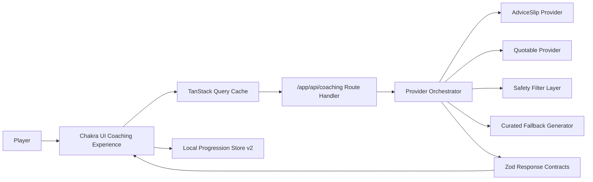

# Advicely - Momentum Coaching Loop

Advicely is a gamified daily coaching product focused on repeat engagement: fetch a themed coaching card, commit to a reflection, earn XP, and build a streak over time.

## Product Value
- Fast daily loop with low friction and high repeatability.
- Safety-filtered provider orchestration with curated fallback continuity.
- Local progression economy: XP, streaks, sessions, and reflection history.
- Share-safe reflection cards with no private context leakage.

## Experience Map
- `/` daily coaching loop and reward claim flow
- `/progress` progression analytics and momentum diagnostics
- `/library` reflection archive and replay starter tracks
- `/share/[id]` sanitized share card experience

## Architecture


## Deployment Model
- Platform: Vercel
- Production branch: `master`
- Branches/PRs: preview deployments when Git integration is connected

## Security Posture
- Sensitive provider values remain server-only environment variables.
- No `NEXT_PUBLIC_` secrets.
- CSP and security headers enforced in [`next.config.ts`](/Users/aib/Desktop/Development/Projects/_rewrites/advicely/next.config.ts).
- Share routes expose only sanitized reflection text and XP metadata.

## Environment
Copy `.env.example` to `.env.local`.

- `COACHING_PROVIDER_URL`: optional override for the primary advice provider endpoint.

## Local Development
```bash
pnpm install
pnpm dev
```

## Quality Gates
```bash
pnpm run check
pnpm run test:e2e
pnpm run audit:high
pnpm run docs:check
```

## Troubleshooting
- If provider responses degrade, fallback cards should continue rendering.
- If reflections do not persist, clear local storage and restart the loop.
- If docs checks fail, run `pnpm run docs:check` and fix markdown or Mermaid syntax issues.
