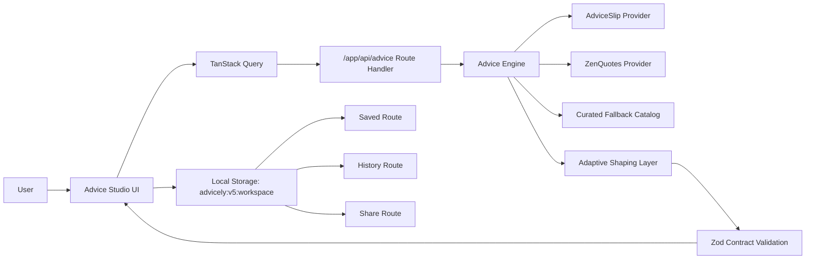

# Advicely v5 Utility Studio

Advicely is a practical advice utility for everyday decisions.
Use it in one tap, or add context for tailored guidance. Save what helps, find it later, and share cleanly.

## Product Value
- Fast generation: useful advice in seconds.
- Context-aware output: advice shape adapts by intent instead of fixed labels on every card.
- Local-first control: saved/history/share are browser-local in this phase.

## Architecture


Detailed system design: [docs/architecture.md](docs/architecture.md)

## Route Map
- `/` Advice Studio
- `/saved` Saved advice with search and filters
- `/history` Generated advice history
- `/share/[id]` Local share card view
- `/api/advice` POST-only normalized advice endpoint

## Runtime Stack
- Next.js App Router (typed routes enabled)
- React 19 + TypeScript strict mode
- Chakra UI v3 system theming
- TanStack Query v5
- Zod contracts at API and view-model boundaries
- Vitest + Playwright

## Environment Contract
Copy `.env.example` to `.env.local`.

Server-only environment variables:
- `ADVICE_PROVIDER_PRIMARY_URL`
- `ADVICE_PROVIDER_SECONDARY_URL`
- `ADVICE_REQUEST_TIMEOUT_MS`

No sensitive values should be exposed through `NEXT_PUBLIC_*`.

## Local Development
```bash
pnpm install
pnpm dev
```

## Quality Gates
```bash
pnpm run check
pnpm run test:e2e
pnpm run docs:check
pnpm run audit:high
```

## Deployment Model
- Platform: Vercel
- Production branch: `master`
- Preview deployments: pull requests and feature branches
- Auto deploy: GitHub connected Vercel project

## Security Posture
- CSP and hardened security headers in `next.config.ts`
- Server-only env parsing in `lib/env.ts`
- Provider calls restricted to server route handlers
- CI gate includes `audit:high` and CodeQL

## Troubleshooting
- Provider outage: app returns fallback guidance with retry path.
- Duplicate-feeling advice: recent hash dedupe avoids immediate repeats.
- Hydration mismatch in development: this repo uses `next dev --webpack` for stable Chakra Emotion hydration.
- Local state reset: clear browser storage key `advicely:v5:workspace`.
- Docs check failure: run `pnpm run docs:check` and fix markdown/diagram issues.
