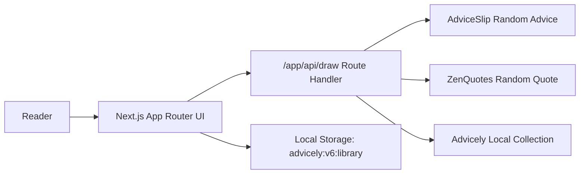

# Advicely

Advicely is an honesty-first deck for random advice and quotes.

It does three things well:
- draws one random card from a clearly labeled live source or the Advicely Reserve
- lets you save cards and attach private notes in your browser
- keeps sharing clean by preserving attribution and hiding personal notes by default

It does not claim to be a contextual assistant, a coaching engine, or professional advice.

## Architecture



## Product Truth

- `Advice` mode draws from AdviceSlip.
- `Quote` mode draws from ZenQuotes.
- `Mixed` mode can draw either.
- If a live source fails, duplicates a recent draw, or returns unusable content, the app falls back to the Advicely Reserve.
- Personal notes stay local to the browser and are never sent to AdviceSlip or ZenQuotes.

Official provider references:
- [AdviceSlip API](https://api.adviceslip.com/)
- [ZenQuotes Documentation](https://docs.zenquotes.io/zenquotes-documentation/)

## Routes

- `/`: draw deck
- `/saved`: saved cards with local notes
- `/history`: recent draws
- `/share/[id]`: local share view
- `/sources`: source behavior and limits

## Runtime Contract

### `POST /api/draw`

Request body:

```json
{
  "mode": "mixed",
  "avoidRecentHashes": ["<sha256>"]
}
```

Response body:

```json
{
  "card": {
    "id": "uuid",
    "kind": "quote",
    "text": "Life is like playing the violin in public and learning the instrument as one goes on.",
    "author": "Samuel Butler",
    "source": "zen_quotes",
    "sourceLabel": "ZenQuotes",
    "provenance": "live",
    "textHash": "<sha256>",
    "drawnAt": "2026-03-06T00:00:00.000Z"
  },
  "meta": {
    "requestId": "uuid",
    "drawnAt": "2026-03-06T00:00:00.000Z",
    "outcomes": {
      "adviceSlip": "skipped",
      "zenQuotes": "accepted"
    }
  }
}
```

## Environment

See [`./.env.example`](./.env.example).

Server-only variables:
- `ADVICE_SLIP_URL`
- `ZEN_QUOTES_RANDOM_URL`
- `DRAW_REQUEST_TIMEOUT_MS`

## Quality Gates

- `pnpm run lint`
- `pnpm run typecheck`
- `pnpm run test`
- `pnpm run test:e2e`
- `pnpm run build`
- `pnpm run docs:check`
- `pnpm run audit:high`
- `pnpm run check`

## Development Notes

- This Chakra UI + Next.js stack is pinned to webpack for both development and production builds.
- Use `pnpm dev` and `pnpm build`; both are already configured with `--webpack` in `package.json`.
- Share links are local-only because saved cards and notes live in browser storage.

## What This App Is Not

Advicely is not medical, legal, financial, crisis, or otherwise professional advice. It is a clean draw, save, and reflection tool built around explicit source attribution.
