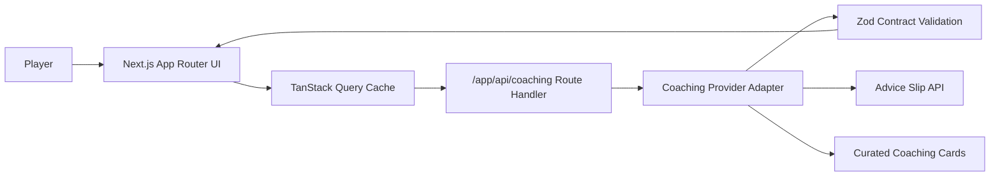

# Advicely Coach

Advicely Coach is a behavior-change micro-experience with themed guidance, reflection loops, and resilient fallback coaching.

## Highlights
- Theme-driven coaching tracks (focus, confidence, resilience, clarity).
- Reflection memory loop for repeat engagement.
- Live provider integration with curated fallback continuity.
- Typed route contracts and strict server/client boundary.

## Architecture


## Deployment Model
- Platform: Vercel (production)
- Branch strategy: `master` auto-promotes to production
- Previews: feature branch and PR previews when Git integration is active

## Tech Stack
- Next.js 16 App Router
- React 19 + TypeScript strict mode
- TanStack Query v5
- Zod v4
- Tailwind CSS v4
- Vitest + Playwright

## Local Development
```bash
pnpm install
pnpm dev
```

## Quality Gates
```bash
pnpm run check
pnpm run test:e2e
pnpm run audit:high
pnpm run docs:check
```

## Environment
Copy `.env.example` to `.env.local`.

- `COACHING_PROVIDER_URL` optional live provider URL override.

## Troubleshooting
- If live coaching fails, fallback cards should still render.
- If copy-to-clipboard fails, browser permissions may be blocking clipboard API.
- If docs CI fails, run `pnpm run docs:check` and fix markdown/mermaid syntax.
