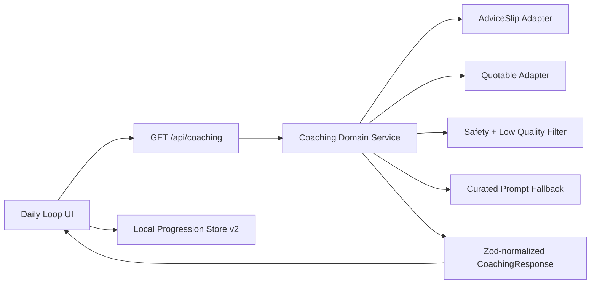

# Advicely Architecture v3

## Runtime and Boundaries
- Framework: Next.js App Router + TypeScript strict mode.
- UI baseline: Chakra UI with route-specific client components.
- Data boundary: route handler returns only Zod-validated normalized payloads.
- Persistence boundary: browser-local progression schema `version: 2` only.

## Topology

## Data Contracts
- `CoachingResponse`
  - `card.id`, `card.theme`, `card.headline`, `card.prompt`
  - `card.reflection`, `card.microAction`, `card.xpReward`
  - `card.source`, `card.confidenceScore`, `card.fallbackUsed`, `card.generatedAt`
  - `providerHealth[]`, `partialData`
- `ProgressionState`
  - `version`, `streakDays`, `totalXp`, `sessionsCompleted`, `lastCheckInDate`, `reflections[]`

## Error Model
- `unavailable`: all providers fail, fallback path engaged.
- `invalid_payload`: adapter payload rejected by Zod.
- `partial`: provider returns minimally useful data while fallback fills gaps.
- `stale`: provider freshness cannot satisfy target recency.
- `rate_limited`: upstream throttling encountered, fallback continuity used.

## Security Notes
- Provider endpoints and any sensitive values are server-only.
- Share-card route does not expose provider diagnostics or internal env values.
- CSP and secure headers are enforced globally.
