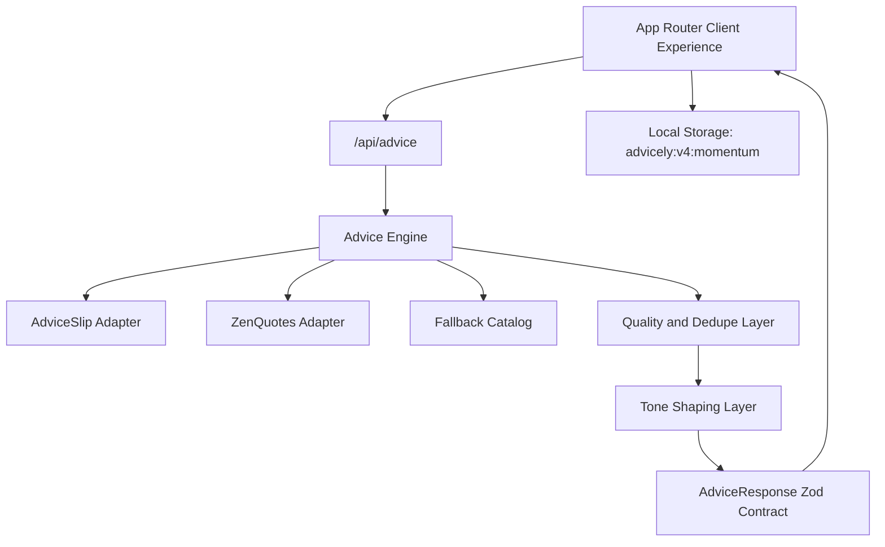

# Advicely v4 Architecture

## Intent
Advicely v4 optimizes for an immediate advice loop with robust reliability safeguards and a light momentum layer.

## System Topology

## Public Contracts
- `AdviceCardVM`
  - id, headline, advice, microAction, reflectionPrompt
  - toneProfile, source, sourceAttribution
  - freshnessMinutes, confidence, fallbackUsed
  - errorState, textHash, generatedAt
- `AdviceMetaVM`
  - requestId, generatedAt
  - providerHealth (primary/secondary)
  - diagnostics
- `ShareCardVM`
  - id, headline, advice, toneProfile, source, confidence, createdAt
- `MomentumStateVM`
  - versioned local persistence (`version: 4`)

## Failure Modes
- `unavailable`: provider request failure or timeout
- `stale`: reserved for stale upstream payload semantics
- `partial`: low-quality or duplicate payload rejected
- `rate_limited`: upstream 429
- `invalid_payload`: schema mismatch from provider

## Storage Keys
- `advicely:v4:momentum`

## Security Boundaries
- External API calls happen only in server route handlers.
- Env parsing is server-only (`lib/env.ts`).
- CSP and hardened security headers are configured globally.

## Deployment and Operations
- Vercel hosts production and previews.
- `master` auto-deploys to production.
- CI gate requires lint, typecheck, test, e2e, build, docs checks, and high-severity audit.
