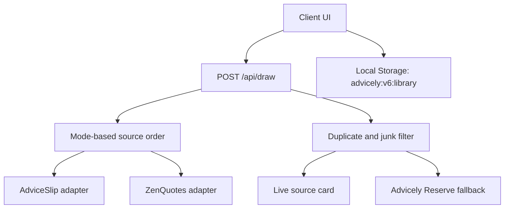

# Advicely v6 Architecture

## Summary

Advicely v6 is a local-first random draw app.

The server selects a live advice or quote source based on the requested mode, performs only minimal normalization and filtering, and returns one source card with explicit provenance. The client stores draw history, saved cards, copy cards, and private notes in local storage.

## Data Flow



## API Contract

### `POST /api/draw`

Request:

```ts
interface DrawRequestVM {
  mode: "advice" | "quote" | "mixed";
  avoidRecentHashes?: string[];
}
```

Response:

```ts
interface SourceCardVM {
  id: string;
  kind: "advice" | "quote";
  text: string;
  author?: string;
  source: "advice_slip" | "zen_quotes" | "advicely_reserve";
  sourceLabel: string;
  provenance: "live" | "fallback";
  fallbackReason?: "provider_unavailable" | "invalid_payload" | "filtered" | "duplicate";
  textHash: string;
  drawnAt: string;
}

interface DrawMetaVM {
  requestId: string;
  drawnAt: string;
  outcomes: {
    adviceSlip: "accepted" | "duplicate" | "filtered" | "unavailable" | "invalid_payload" | "skipped";
    zenQuotes: "accepted" | "duplicate" | "filtered" | "unavailable" | "invalid_payload" | "skipped";
  };
}
```

## Storage Contract

Key:
- `advicely:v6:library`

Stored shape:

```ts
interface LibraryStateVM {
  version: 6;
  history: SourceCardVM[];
  savedCards: Array<SourceCardVM & { savedAt: string; note?: string }>;
  copyCards: Array<{ id: string; createdAt: string; card: SourceCardVM; note?: string }>;
  preferences: {
    lastMode: "advice" | "quote" | "mixed";
  };
}
```

## Guardrails

- Provider content is displayed as normalized source text, not rewritten guidance.
- Personal notes are local-only and never sent upstream.
- Fallback cards are labeled as reserve cards in the UI.
- The app uses webpack for both `dev` and `build` to avoid the Chakra/Emotion hydration issue seen in Turbopack builds.
- Copy output excludes personal notes unless the user explicitly opts in on the copy screen.

## Failure Modes

- AdviceSlip unavailable: fall back to the Advicely Reserve.
- ZenQuotes unavailable: fall back to the Advicely Reserve.
- Duplicate recent draw: fall back to a non-duplicate reserve card.
- Invalid upstream payload: reserve card with explicit fallback provenance.

## Release Checklist

- No browser console errors on `/`, `/saved`, `/history`, and `/copy/[id]`
- Keyboard traversal works for draw, save, note, copy, and navigation flows
- `lint`, `typecheck`, `test`, `test:e2e`, `build`, `docs:check`, and `audit:high` all pass
