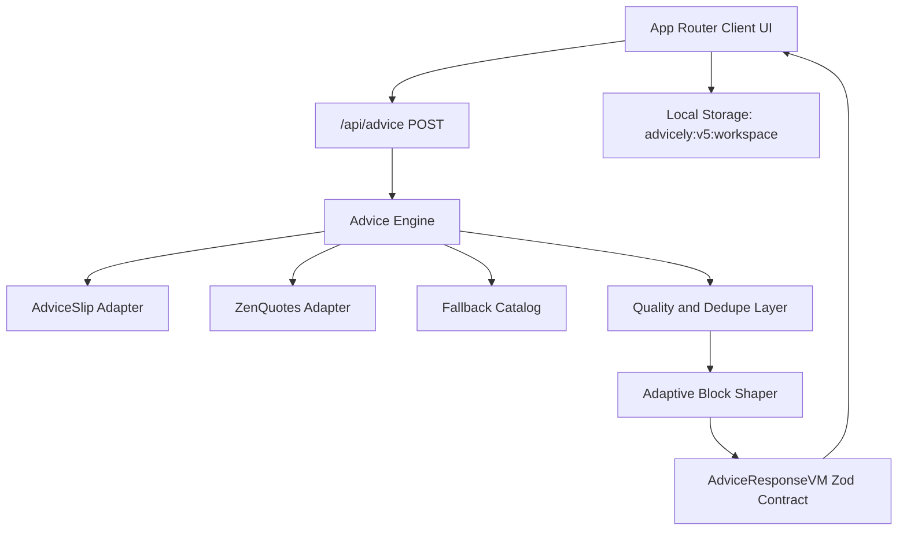

# Advicely v5 Architecture

## Intent
Advicely v5 is a utility-first advice tool for normal users: generate relevant advice quickly, save it, retrieve it, and share it.

## System Topology

## Request Contract
`POST /api/advice`

- `context?: string` (0..600)
- `intent: "quick" | "decision" | "communication" | "planning" | "stress" | "general"`
- `style: "balanced" | "direct" | "supportive" | "creative"`
- `detail: "short" | "standard" | "deep"`
- `avoidRecentHashes?: string[]`

## Response Contract
- `AdviceCardVM`
  - `id`, `headline`, `summary`
  - `blocks: AdviceBlockVM[]` (adaptive)
  - `intent`, `style`, `detail`, `context?`
  - `source`, `sourceAttribution`
  - `confidence`, `fallbackUsed`, `errorState`, `textHash`, `generatedAt`
- `AdviceMetaVM`
  - `requestId`, `generatedAt`
  - `providerHealth` (primary/secondary)
  - `diagnostics` (internal-facing trace hints)

### `AdviceBlockVM` Types
- `core_advice`
- `steps`
- `script`
- `reframe`
- `caution`
- `checklist`

## Failure States
- `unavailable`
- `stale`
- `partial`
- `rate_limited`
- `invalid_payload`

## Local Persistence
Storage key:
- `advicely:v5:workspace`

Stored collections:
- `history[]`
- `savedCards[]`
- `shareCards[]`
- `preferences`

No backward migration from v4 key is provided by design.

## Security Boundaries
- External providers are called only from server route handlers.
- Env parsing is server-only (`lib/env.ts`).
- CSP and hardening headers are configured in `next.config.ts`.

## Deployment and Operations
- Vercel production deploys from `master`.
- PR previews are required for integration validation.
- CI required checks: lint, typecheck (with pre-clean + `next typegen`), test, e2e, build, docs checks, and high-severity audit.
